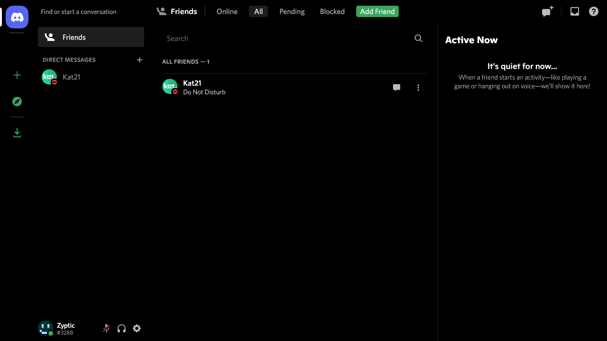
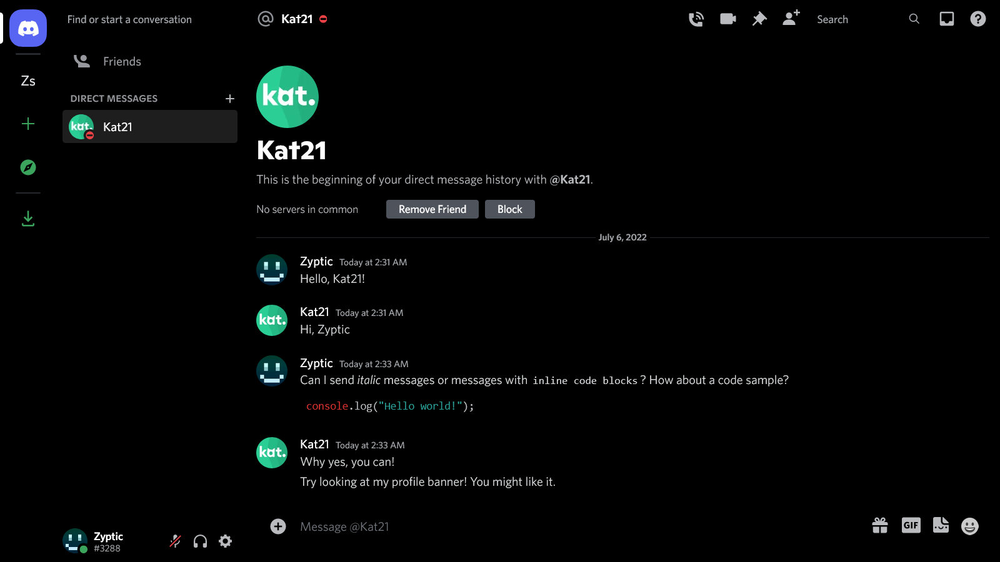
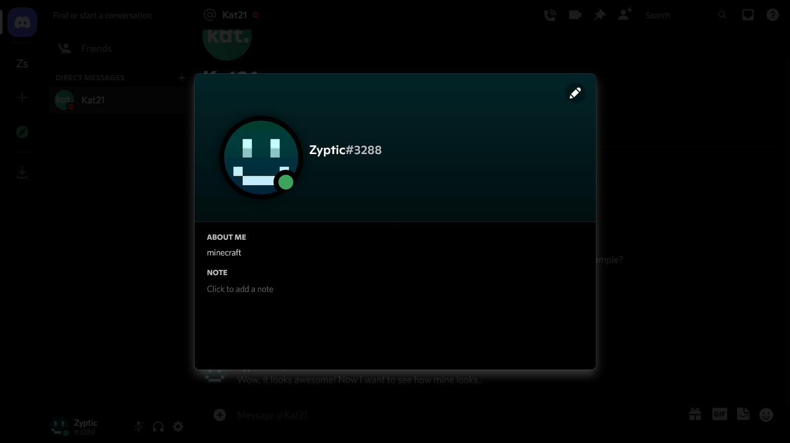
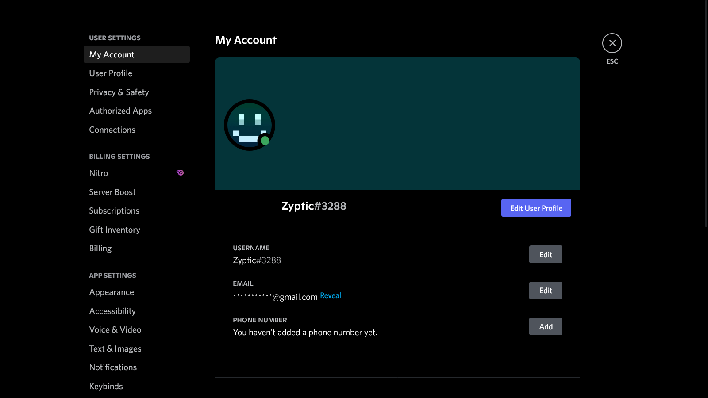

# Discord Amoled Dark Theme for Desktop

This theme aims to bring the Android-only AMOLED dark theme (full black) to Discord for desktop and also includes some extra features.

**Right now, the theme is not perfect but most of the UI should look fine.**

## Usage

There are 2 ways to use this theme:

1. Install the `dist/theme.css` file in your Discord client (requires a modded client)
2. Inject it manually via DevTools (Ctrl+Shift+I, can be tedious if you restart Discord; not recommended)

> Note: 
> To inject the theme via devtools, copy the contents of the [theme.js script](dist/theme.js) and paste it into the DevTools console.

## Screenshots

These screenshots were taken on my alt account.

**The settings page has an issue right now, so the screenshots may not reflect the current state of the theme.**

I might switch to using flexbox on the banner to make it centered for people without badges.