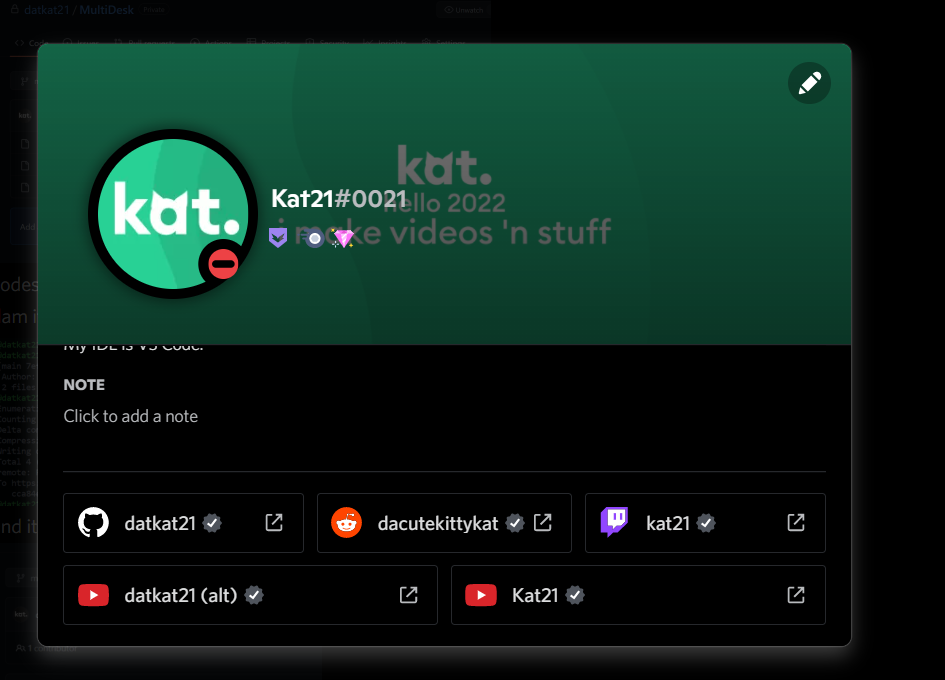
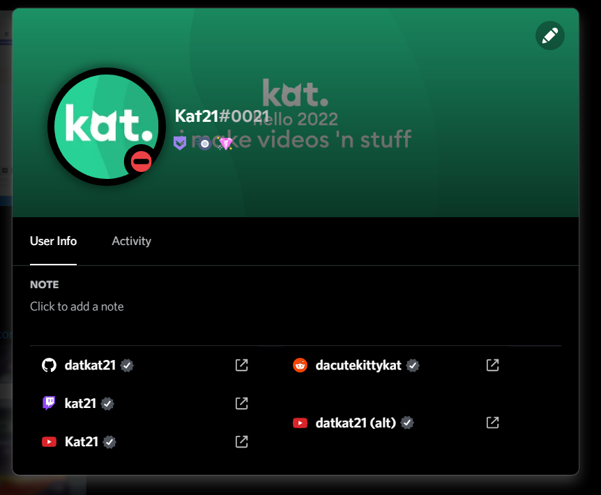
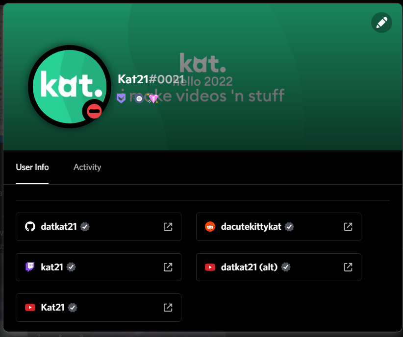

# Discord Amoled Dark Theme for Desktop

This theme aims to bring the Android-only AMOLED dark theme (full black) to Discord for desktop and also includes some extra features.

**Right now, the theme is not perfect but most of the UI should look fine.**

## Usage

There are 2 ways to use this theme:

1. Install the `dist/theme.css` file in your Discord client (requires a modded client)
2. Inject it manually via DevTools (Ctrl+Shift+I, can be tedious if you restart Discord; not recommended)

> Note: 
> To inject the theme via devtools, copy the contents of the [theme.js script](dist/theme.js) and paste it into the DevTools console.

## ⚠️ Note on the current state of the theme

Discord recently rolled out an update (just a couple days after I released the theme) which breaks the way the connections work using this theme. They are now **split into columns** which means that the wrapping of connections is no longer possible.

More details

### Before

### After

The most I can do is attempt to revert my forced layout change and bring the border back to make it look nearly authentic to the original layout (without wrapping, sadly.)

Screenshot of my "fix"

 (Fix is in quotations because it is only somewhat the same as before.)

## Screenshots

These screenshots were taken on my alt account.

**The settings page has an issue right now, so the screenshots may not reflect the current state of the theme.**

I might switch to using flexbox on the banner to make it centered for people without badges.